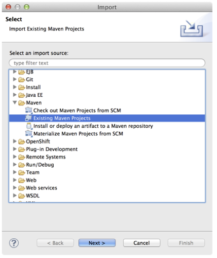

:exercises: link:https://github.com/gpe-mw-training/fuse-for-practitioners-foundational-labs/archive/skeleton.zip[Skeleton]
:settings: link:https://github.com/gpe-mw-training/camel-labs/blob/exercise/features-exercises/settings.xml[Fuse configured settings.xml]

== Install Required Software on Your Machine

|===
| Software | Version & URL | Notes |

| Java SE | http://www.oracle.com/technetwork/java/javase/downloads/index.html[1.8 or higher] | Required |
| Apache Maven | http://maven.apache.org[3.0.5 or higher] | Required |
| JBoss Developer Studio | http://www.jboss.org/products/devstudio/overview/[8.1.0.GA] | Required. Account on the jboss.org web site is needed. |
| Integration Stack | https://devstudio.jboss.com/updates/8.0/integration-stack/[8.0.2] | Required. Account on the jboss.org web site is needed. |
| SoapUI | http://sourceforge.net/projects/soapui/files/[latest] | Optional |
|===

== Install Lab Assets

The skeleton of the usecases's project is available in the following zip archive:

{skeleton}

Right click over the link, and save the file to your machine.
Unzip the archive on your local machine's filesystem.

== Configure Your Local Maven Environment

All the usecases to be designed involve using Apache Maven modules with dependencies on Apache Maven libraries supported in JBoss Fuse. Red Hat provides both online and offline Maven repositories for JBoss Fuse.
Follow these steps to configure these online repositories on your machine:

. Edit the Apache Maven `settings.xml` file located under the directory `$HOME/.m2` or `~/.m2`.
+
[NOTE]
If this file does not exist under this location, you can also edit the same file which is available under the `conf` subdirectory of the Apache Maven installation directory.
. Replace the contents of your Maven `$HOME/.m2/settings.xml` with this {settings}.
. Review the details of your new Fuse enabled `$HOME/.m2/settings.xml`
.. Within the `<profile>` tags in the `settings.xml` are defined the `JBoss Fuse` repositories that you need to build the code during execution of `mvn compile` or `mvn install` commands.
.. Within the `<activeProfile>` tags in the `settings.xml` is the name of the default profile used when Apache Maven is running.

== JBoss Developer Studio

For all the usecases, you must have JBoss Developer Studio installed in your local development environment. You will use JBoss Developer Studio to design Apache Camel Routes, data transformation mapping, run the the project.

== Import the Project in JBoss Developer Studio

. Open *JBoss Developer Studio*.
. Import the `fuse-for-practitioners-foundational-labs-VERSION_NUMBER` Apache Maven project into a new workspace:
.. Select *File -> Import* from the menu.
.. Select *Maven -> Existing Maven Projects*.
+
.Import `usecases` - part 1

.. Click *Next*.
.. Click *Browse* and navigate to the directory containing the project. Click `Open`.
.. Make sure there is a check under Projects window next to */pom.xml* of `org.fuse.usecase:all:1.0:pom`.
.. Click on *Finish* button

Your skeleton usecases project should be imported
