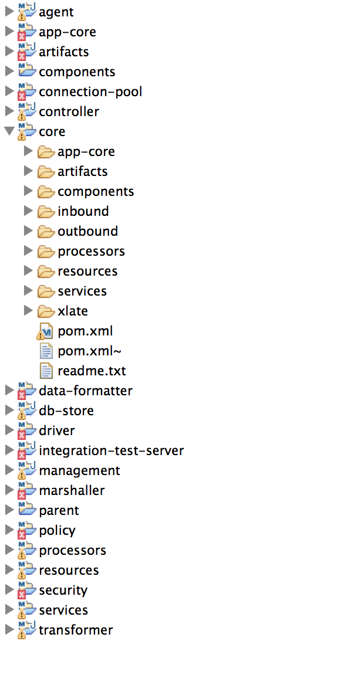

:scrollbar:
:data-uri:

== Inbound Use-Case Lab

.Goals
* Build a RESTful CXF service that receives the patient record and validates it
* Marshal the patient object to XML using JAXB marshaller
* Publish the XML to a queue and send an acknowledgement back to the client (Done transformer in the use case document)
* Create a test payload to test the scenario

:numbered:

== Import the Lab Project

. In JBoss Developer Studio, switch to the *Git* perspective. 
. Click the icon at the top to clone a Git repository and add the clone to this view.
. In the *URI* text box, copy and paste the following: 
+
------
https://github.com/gpe-mw-training/fuse-for-practitioners-labs.git
------
+
. Switch to *Project Explorer* for the *JBoss* perspective.
. Import a new Maven project by selecting *File -> Import -> Maven -> Existing Maven Projects -> Next*. Import the `core` and it's parent project
. Navigate to the location of the Git projects for the Data Transformation tool and click *Finish*.
. Click the *Project Explorer* tab and expand the `Inbound` project node. 
+  
.Application structure

. Examine the following files and folders that appear in the expanded view:

* `core`: Area in which you will develop the 3 parts of the use-case. 
+
Sub-folders are:
+
** `artifacts` : WSDL and XSD files you work from
** `inbound` : route or service that receives the patient payload
** `xlate` : route that marshals the Java object to XML
** `outbound` : route that publishes the XML payload on a A-MQ queue

== Develop the Inbound application

=== CXF Rest Service
. Recommendation is to us a standard REST service CXF-RS. You can use Spring or Blueprint which starts a RESTful service with an impl. Inside the impl, you can create a producer template and call a direct endpoint in Camel. Go to blueprint.xml and create a bean which is the REST service. You will implement the add, update and search methods in the REST endpoint service.

Alternately, you can use the Camel REST component. 

Use the former design to be able to formulate a proper response back to the client to indicate why the request failed. Also you can validate schema against the incoming payloads.

Implement a Java class that is the REST endpoint. The class creates a producer template and calls the direct route. The direct route puts the message on A-MQ and returns, allowing you to return an 'OK' status to the client in the Java class.

=== Marshal the Java object to XML

Under the artifacts folder, the REST schema is provided. Use the schema to create a set of JAXB objects that allow you to do the mapping.

=== Publish the XML on A-MQ queue

The benefit of sending an XML Message is traceability. For that reason, convert to XML before dropping it on the queue. In the next part of the exercise, you will need to unmarshal the XML received on the queue to an object for mapping purposes.

=== Develop the JUnit Tests

Develop a feature and a fabric profile. Test using SOAPUI or curl. 

=== Build the `Inbound` Project
. On the command line, run the following commands:
* mvn clean install
* mvn camel:run

